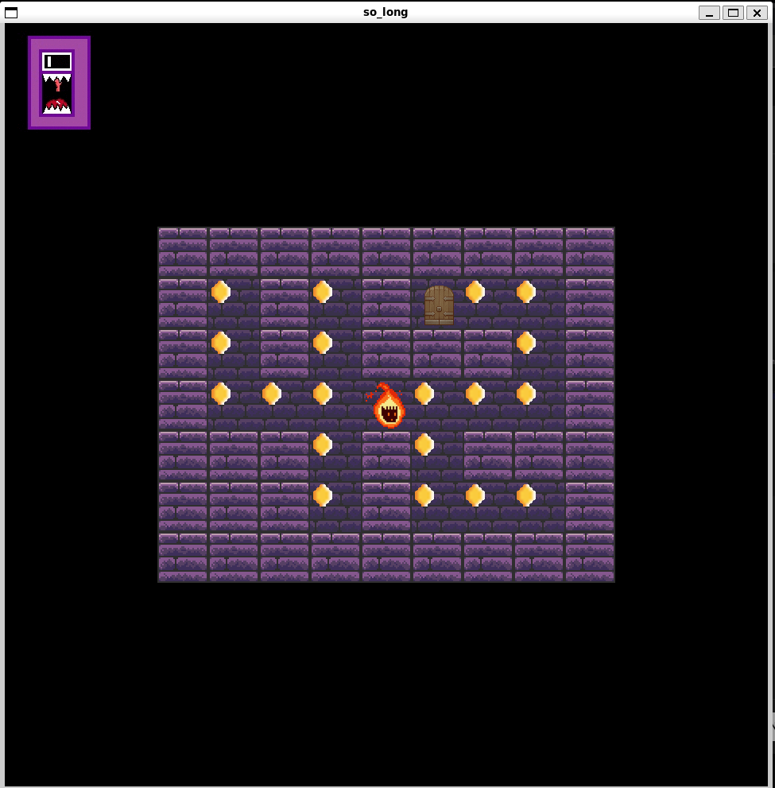
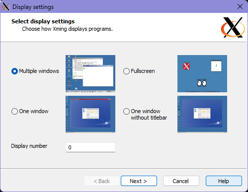
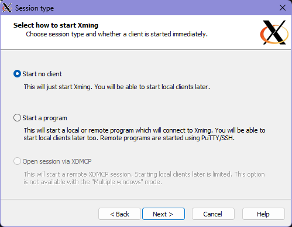
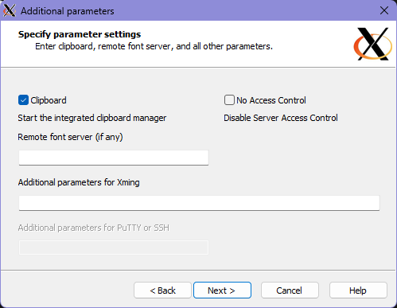
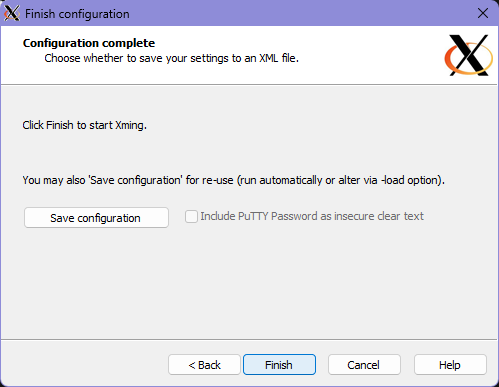

# 🏆 so_long
**so_long** is a simple 2D game project developed as part of the 42 Coding School curriculum. The goal of this project is to create a small game using **MinilibX**, where the player navigates a character through a maze, collecting collectibles, avoiding enemies, and reaching the exit.

<p align="center">
  <a href="https://www.youtube.com/watch?v=Xwj-zIGUVDw">
    
  </a>
</p>

<p align="center">
  <b>▶ Click the image to watch the video</b>
</p>

### 🏁 Path Validation with Flood Fill Algorithm

To ensure that every **map** is valid and playable, this project implements the **Flood Fill Algorithm** to check:
- Whether the **exit (`E`) is reachable** from the player's starting position.
- If **all collectibles (`C`) can be collected** before reaching the exit.
- That the map is properly **enclosed** with walls (`1`) and follows all required rules.

### 🎨 Sprite Animations

To enhance the visual experience, **so_long** includes sprite animations for various game elements. These animations help bring the game to life by adding movement to:

- **Player Character (`P`)**: Smooth walking animations when moving.
- **Collectibles (`C`)**: Animated effects to make them more noticeable.
- **Enemies (`X`)** (if implemented): Movement and idle animations.
- **Exit (`E`)**: A subtle animation indicating when it's open after collecting all items.

The animations are handled by swapping textures at set time intervals using **frame-based rendering** in MinilibX.

---

### 🎮 How to Play

The objective of **so_long** is to navigate through a maze, collecting all **collectibles (`C`)** before reaching the **exit (`E`)**. Follow these rules:

#### ✅ Game Rules:
1. The player (`P`) can move **up, down, left, or right** using the keyboard.
2. The map must be **fully enclosed by walls (`1`)**.
3. The player **must collect all `C` items** before the exit (`E`) becomes accessible.
4. If there are enemies (`X`), avoid them or the game will end.
5. The game ends when the player **successfully reaches the exit** after collecting all items.

## Table of Contents

- [🏆 42 School - so_long](#-42-school---so_long)
- [🚀 Features](#-features)
- [🛠️ Installation & Usage](#️-installation--usage)
  - [Prerequisites](#prerequisites)
  - [Installation](#installation)
  - [Running the Game](#running-the-game)
- [🎮 Controls](#-controls)
- [📜 Map Configuration](#-map-configuration)
- [🏗️ Project Structure](#️-project-structure)
- [📌 Learning Outcomes](#-learning-outcomes)
- [📜 Credits](#-credits)

## 🚀 Features

- 2D top-down game engine using **MinilibX**
- Player movement with collision detection
- Collectibles that must be gathered before reaching the exit
- Enemy AI (optional challenge)
- Custom map support using `.ber` files

## 🛠️ Installation & Usage

### Prerequisites

- macOS or Linux
- `gcc` or `clang`
- **MinilibX** (included in the repository or needs to be installed separately)

### Compilation
#### Install X11 dependencies (Linux)
```bash
sudo apt-get install libx11-dev libxext-dev
```
This ensures that the necessary X11 dependencies are installed for proper execution of the project.

### Installation

```bash
git clone https://github.com/hanzong111/so_long.git
cd so_long
make
```

## 🖥️ Setting Up Xming

Before running `./cub3d`, ensure that Xming is properly configured and running. Follow these steps:

1. **Select Display Settings**
   
   - Choose **Multiple windows**.
   - Set **Display number** to `0`.
   - Click **Next**.

2. **Select Session Type**
   
   - Choose **Start no client**.
   - Click **Next**.

3. **Additional Parameters**
   
   - Enable **Clipboard**.
   - Click **Next**.

4. **Finish Configuration**
   
   - Click **Finish** to start Xming.

Once Xming is running, proceed with executing `./so_long`.

### Running the Game

```bash
./so_long maps/example.ber
```

## 🎮 Controls

| Key         | Action        |
|------------|--------------|
| W / ↑      | Move up      |
| S / ↓      | Move down    |
| A / ←      | Move left    |
| D / →      | Move right   |
| ESC        | Quit the game |

## 📜 Map Configuration

The `.ber` map file follows a specific format:

- **Walls (`1`)**, **floor (`0`)**, **player (`P`)**, **collectibles (`C`)**, **exit (`E`)**, and optional **enemy (`X`)**.
- The map **must be enclosed** by walls (`1`).
- There must be **exactly one player spawn (`P`)**.
- There must be **at least one collectible (`C`)**.
- There must be **exactly one exit (`E`)**.

### Example of a Valid `.ber` File
```text
111111
1P0C01
1000C1
1C00E1
111111
```
✅ **This map is valid** because it is fully enclosed and follows the `.ber` format.

## 🏗️ Project Structure

```
📂 so_long
├── 📂 src         # Source code
├── 📂 includes    # Header files
├── 📂 maps        # Example map files
├── 📂 sprites    # Texture assets
├── Makefile      # Compilation script
└── README.md     # Project documentation
```

## 📌 Learning Outcomes

- Understanding event handling with MinilibX
- Basics of 2D game development
- File parsing and memory management in C
- Implementing AI behaviors (if enemies are included)

## 📜 Credits

Project developed as part of 42 Coding School curriculum.

👤 **Ong Jing Hanz**

📌 [Your GitHub](https://github.com/hanzong111) | 📧 [Your Email](mailto:hanzong111@gmail.com)